# EnergAI: A Large Language Model–Driven Generative Design Method for Early-Stage Building Energy Optimization
Abstract: *The early stage of architectural design plays a decisive role in determining building energy performance, yet conventional evaluation is typically deferred to later phases, restricting timely and data-informed feedback. This paper proposes EnergAI, a generative design framework that incorporates energy optimization objectives directly into the scheme generation process through large language models (e.g., GPT-4o, DeepSeek-V3.1-Think, Qwen-Max, Gemini-2.5 pro). A dedicated dataset, LowEnergy-FormNet, comprising 2,160 cases with site parameters, massing descriptors, and simulation outputs, was constructed to model site, form and energy relationships. The framework encodes building massing into a parametric vector, applies hierarchical prompt strategies and integrates an automatic fenestration optimization module within a closed-loop interface to ClimateStudio. Experimental evaluations demonstrate that Geometry-Oriented and fuzzy-goal prompts achieve average annual reductions of approximately 16-17% in Energy Use Intensity and 3-4% in energy cost compared with human designs, while performance-oriented structured prompts deliver the most reliable improvements, eliminating high-energy outliers and yielding an average EUI saving rate above 50%.  In cross-model comparisons under an identical toolchain, GPT-4o delivered the strongest and most stable optimization, achieving 63.3% mean EUI savings, ~13 percentage points higher than DeepSeek-V3.1-Think, Qwen-Max and Gemini-2.5 baselines. These results demonstrate the feasibility and indicate the potential robustness of embedding performance constraints at the generation stage, providing a feasible approach to support proactive, data-informed early design*


[**Paper**]() | [**Project Page**]() | [**Model Weights**]() | [**Huggingface Demo**]() |


*Figure 1) Examples of design schemes and corresponding annotations in the dataset*
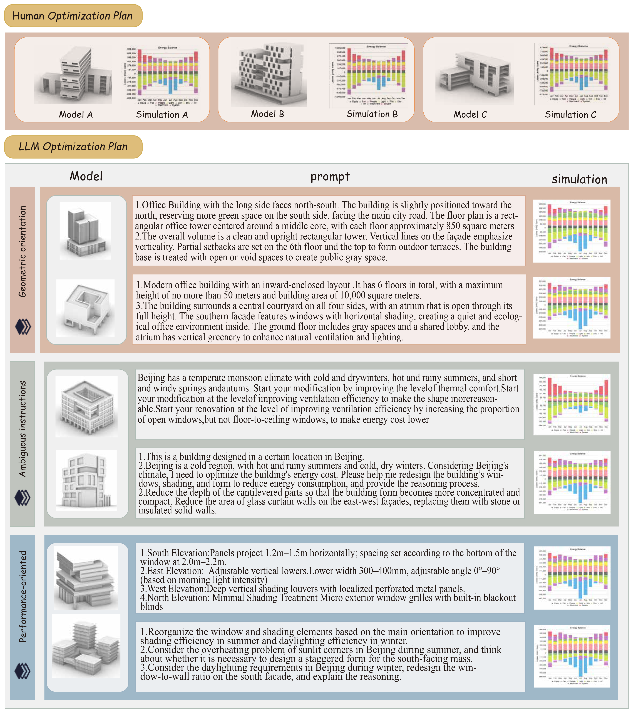

*Figure 2) EnergAI closed-loop iterative workflow of parametric input, LLM prompting, performance simulation, and semantic feedback.*
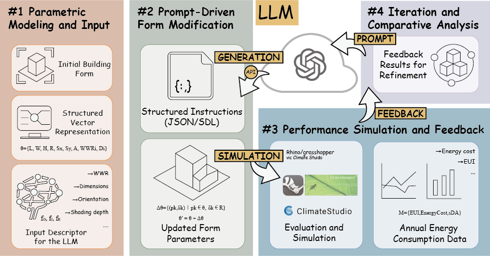

*Figure 3) Experimental site.*
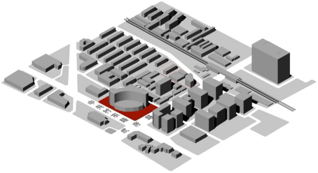

*Figure 4) Scatter plot of annual EUI vs. annual energy cost for the human-designed model and the geometry-oriented LLM-designed model.*
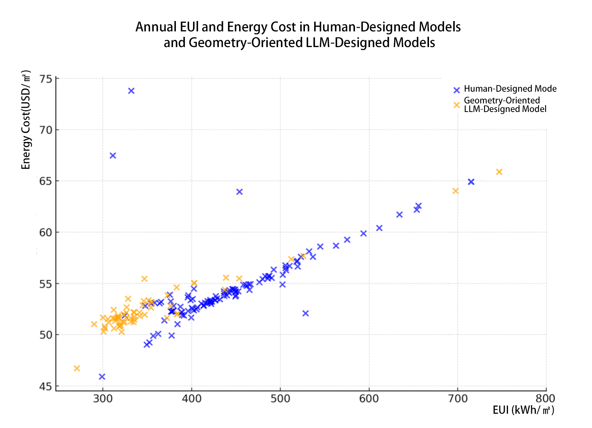

*Figure 5) Impact of climate information on EUI and energy cost.*
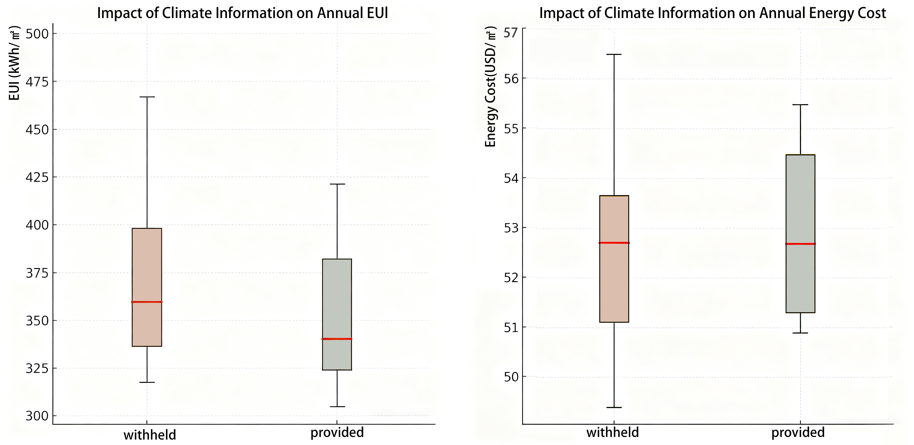

*Figure 6) Impact of design strategy on EUI.*
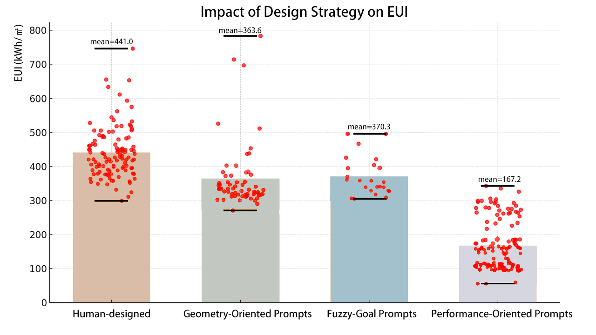

*Figure 7)  Impact of design strategy on energy cost.*
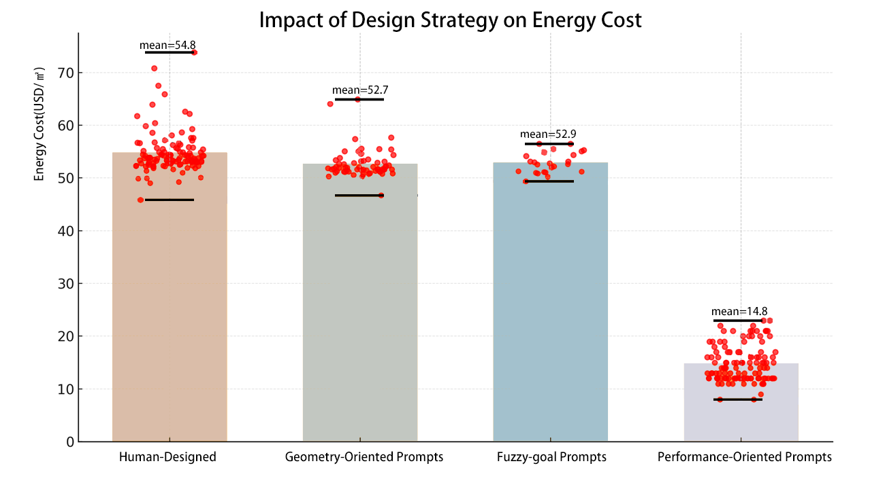

*Figure 8) Wordclouds.*
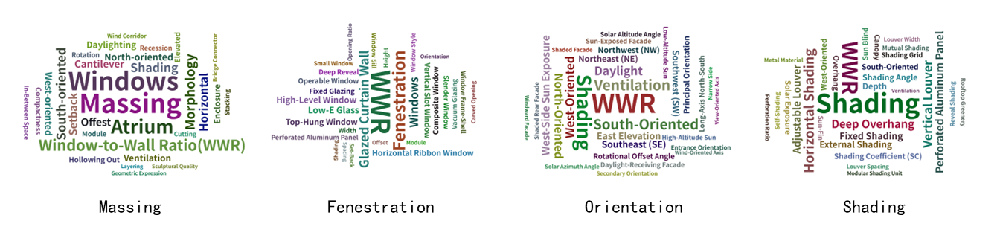

*Figure 9) Mean energy-saving rate versus the number of prompt dimensions. *
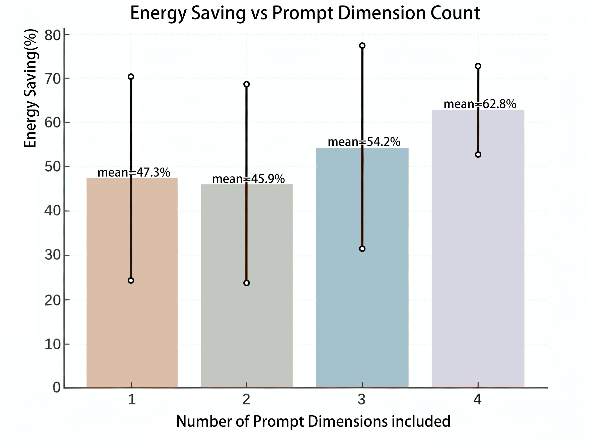


## Table

*Parameter ranges and corresponding regulatory or empirical references defining the feasible constraint space Ω (Beijing, ASHRAE Zone 4)*
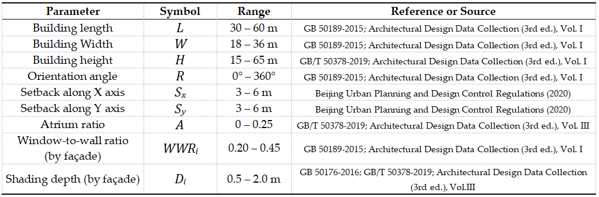

*Statistics of the influence of different prompt dimensions on EUI saving rate (EUI saving rate = (Baseline EUI – Current EUI) / Baseline EUI).*
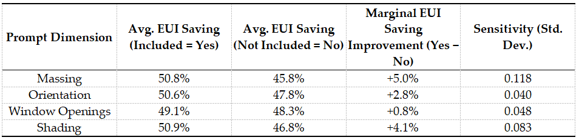


## TODO List

- [x] Release part of LowEnergy-FormNet dataset. 
- [ ] Release EnergAI code and pretrain weights.
- [ ] Upload EnergAI training dataset.


## Inference

```
python EnergAI_Infer.py --dataset LowEnergy-FormNet --model_path ckpts/EnergAI/model_final.pt --prompt_strategy performance-oriented
```
## Train

```
python EnergAI_Train.py --dataset LowEnergy-FormNet --batch_size 32 --prompt_strategy geometry-oriented
```
